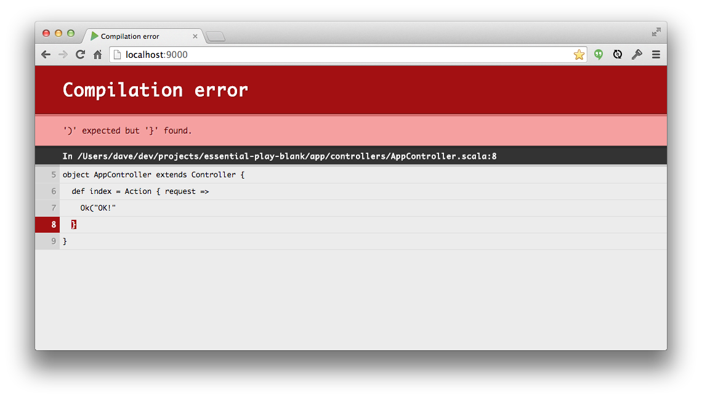
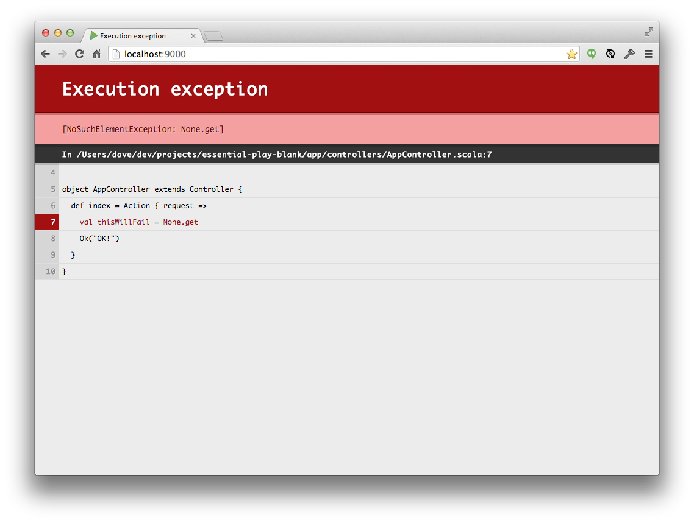
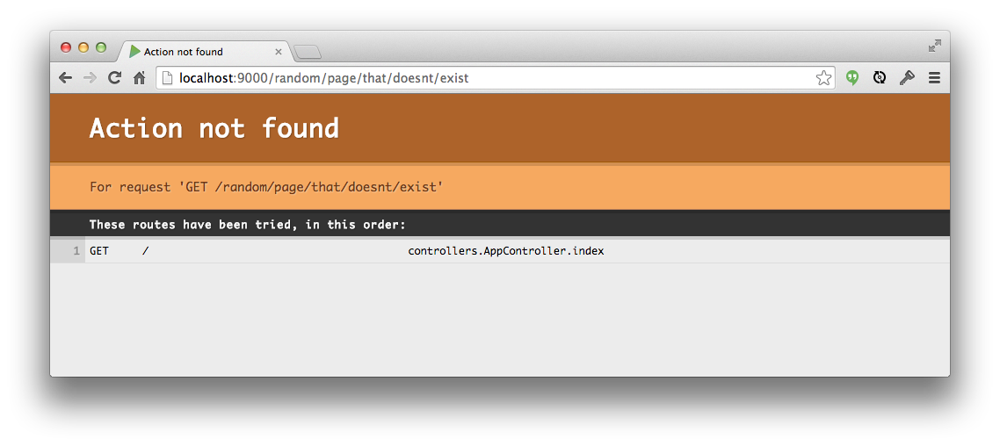

# Handling Failure

In this chapter we've learned how to set up routes, actions, and controllers to handle simple HTTP request/response cycles. What happens, however, when something does wrong? How does Play handle failure?

In each chapter of the course, we will spend one section discussing error handling and recovery. In this section we will see Play's default error handling behaviour; in future chapters we will see how to customise this behaviour and replace it with our own designs.

## Compilation Errors

Play provides a useful mechanism for reporting compilation errors during development. We start Play in development mode using the `run` command in SBT. SBT responds by starting a development web server on `localhost:9000`:

~~~
[hello] $ run
[info] Updating {file:/Users/dave/dev/projects/essential-play-blank/}hello...
[info] Resolving jline#jline;2.12 ...
[info] Done updating.

--- (Running the application from SBT, auto-reloading is enabled) ---

[info] play - Listening for HTTP on /0:0:0:0:0:0:0:0:9000

(Server started, use Ctrl+D to stop and go back to the console...)
~~~

Whenever we access a URL on `localhost`, SBT inspects our source code and recompiles any files that have recently changed. If there are any compilation errors we get error messages *in the web page* as well as on the console:

Note that the web page only reports the *first* error form the console. It is not uncommon for a single programming error to yield mulitple compiler errors, so the message we see on the web page may not always point to the root cause of the problem.

## Runtime Errors

If our code compiles but fails at runtime, we get a similar error page that points to the source of the exception. The exception is reported on the SBT console as well as on the page:

## Routing Errors

Play also generates a 404 page if it can't find an appropriate route for an incoming request. This error *doesn't* appear on the console:

## Take Home Points

Play ships with default 404 and 500 pages out of the box. We get useful error messages for compile errors, runtime errors, and routing errors.

Internal errors are reported on the SBT console as well as on the web.

Although these error messages are useful in development, we need to switch them off when moving our applications into production. We will see how to do this at the end of the next chapter.
